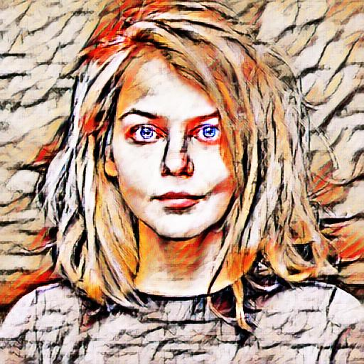

# Perceptual Losses Neural Style Transfer

Implementation of the paper:

> Justin Johnson, Alexandre Alahi and Li Fei-Fe. [Perceptual Losses for Real-Time Style Transfer and Super-Resolution](https://cs.stanford.edu/people/jcjohns/eccv16/) (ECCV 2016). With Dmitry Ulyanov, Andrea Vedaldi and Victor Lempitsky. [Instance normalization: The missing ingredient for fast stylization](https://arxiv.org/abs/1607.08022)


## Examples
<p align='center'>
  
  
  
<br>
</p>

### Different resolutions
<p align='center'>
  
  
</p>


## Dependencies
- Python 3.8
- Tensorfow 2.3


## Usage
### Train
1. Download [MSCOCO images](http://mscoco.org/dataset/#download).
2. Use `--name=<model_name>` and `--content_dir=<coco_path>` to provide model name and content dataset path. 
```
python train.py --name=<model_name> --content_dir=<coco_path> 
```
### Test
Run `test.py`. It will save every content image in the output directory.
```
python test.py --name=<model_name> 
```

### Hparams setting
Set hyperparameters in `hparams.py` file.

### Tensorboard
Run `tensorboard --logdir ./`

## Notes for researchers 
- Images normalized [-1, 1] and tanh activation at the output.

- Conv2d layers with reflect padding.

- Above images are generated after 2,400 steps.


## Licence
Copyright (c) 2020 Emilio Morales. Free to use, copy and modify for academic research purposes, as long as proper attribution is given and this copyright notice is retained. Contact me for any use that is not academic research. (email: mil.mor.mor at gmail.com).


## Citation
```
@misc{morales2020perceptual,
  author = {Morales, Emilio},
  title = {Perceptual losses neural style transfer},
  year = {2020},
  publisher = {GitHub},
  journal = {GitHub repository},
  howpublished = {\url{https://github.com/milmor/perceptual-losses-neural-style}},
}
```


