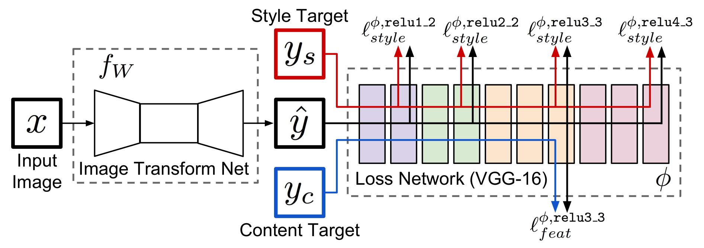
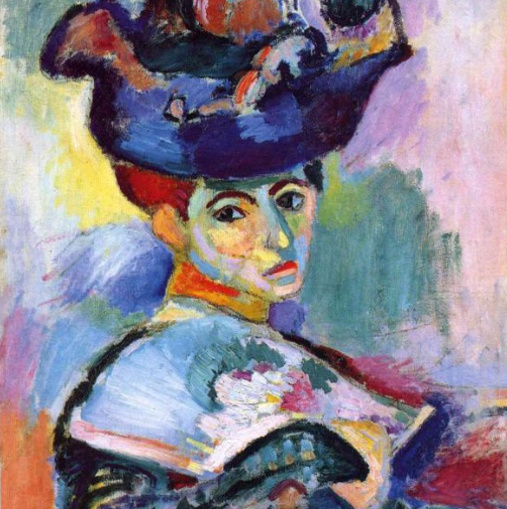
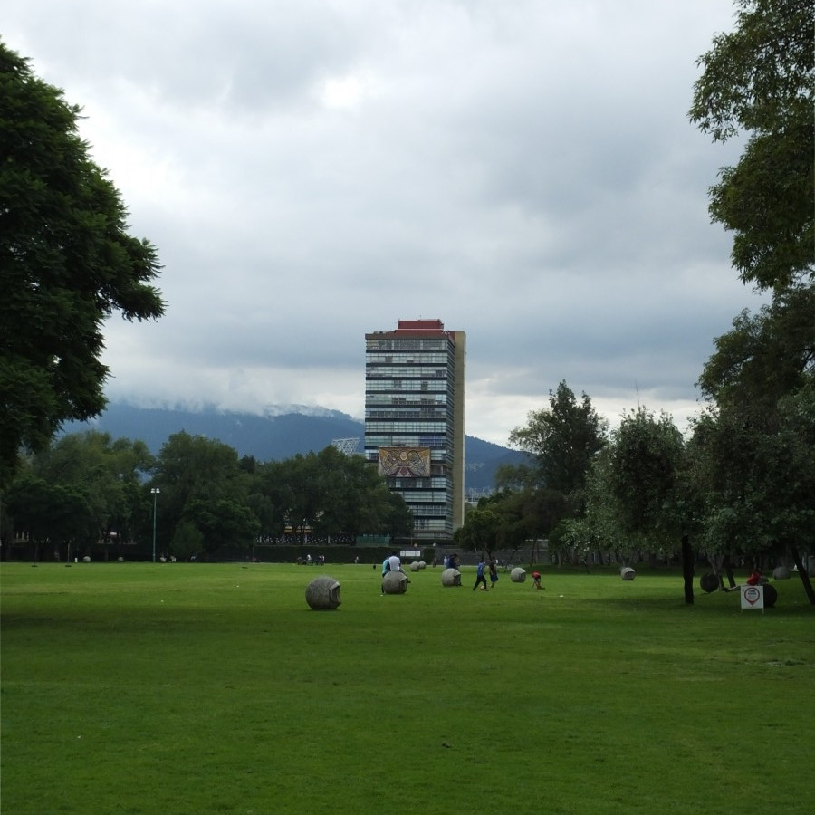
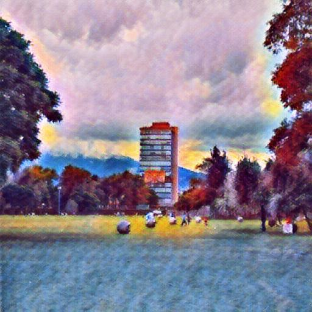
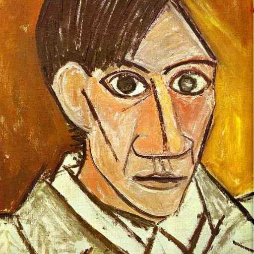
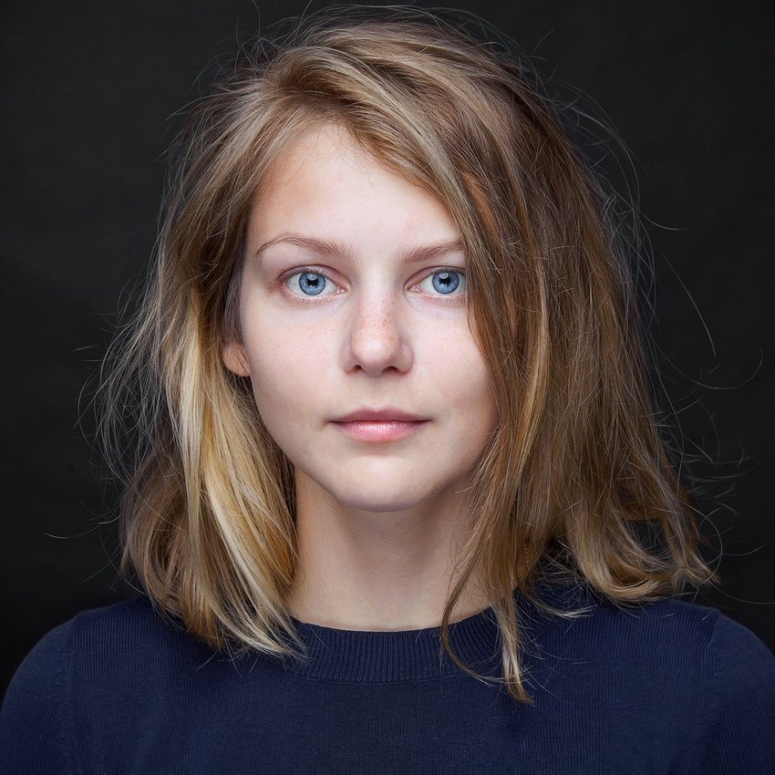
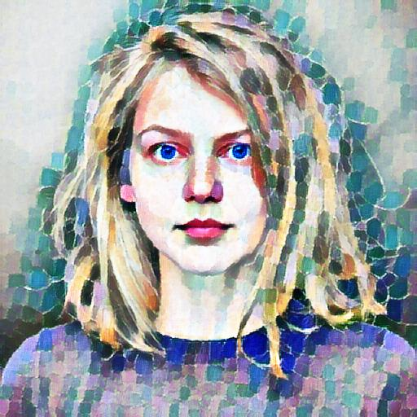
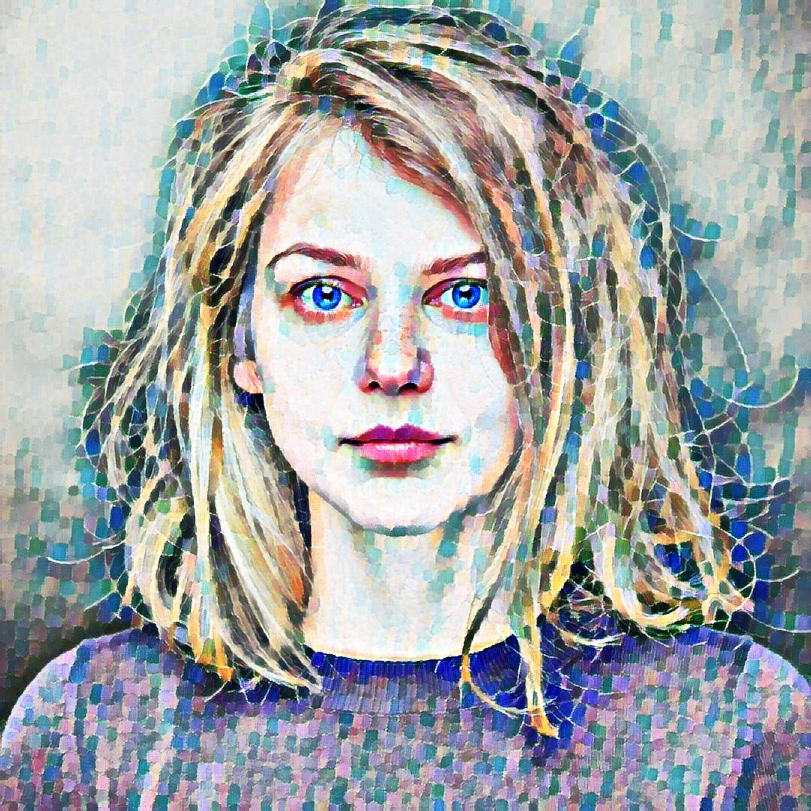

# Perceptual Losses Neural Style Transfer

Implementation of the paper:

> Justin Johnson, Alexandre Alahi and Li Fei-Fe. [Perceptual Losses for Real-Time Style Transfer and Super-Resolution](https://cs.stanford.edu/people/jcjohns/eccv16/) (ECCV 2016). 



This repository implements Dmitry Ulyanov, Andrea Vedaldi and Victor Lempitsky. [Instance normalization: The missing ingredient for fast stylization](https://arxiv.org/abs/1607.08022).

See [here](https://github.com/jcjohnson/fast-neural-style) for the official Torch implementation.

## Examples
Style images from [Arbitrary Style Transfer](https://openaccess.thecvf.com/content_iccv_2017/html/Huang_Arbitrary_Style_Transfer_ICCV_2017_paper.html) paper.
<p align='center'>
  
  
  
  <br>
  
  
  
</p>

### Different resolutions
Delaunay style from Instance normalization paper.
<p align='center'>
  
  
</p>


## Dependencies
- Python 3.8
- Tensorfow 2.4
- Tensorflow Addons 0.12.1


## Usage
### Train
1. Download [MSCOCO images](http://mscoco.org/dataset/#download).
2. Use `--name=<model_name>`, `--style_img=<style_image_path>` and `--content_dir=<coco_path>` to provide model name, style and content dataset path. 
```
python train.py --name=<model_name> --style_img=<style_image_path> --content_dir=<coco_path> 
```
### Test
Run `test.py`. It will save every content image to the output directory.
```
python test.py --name=<model_name> 
```

### Hparams setting
Set hyperparameters on the `hparams.py` file. Use `content_weight` and `style_weight` to adjust the degree of stylization.

### Tensorboard
Run `tensorboard --logdir ./`

## Implementation notes
- Images normalized [-1, 1] and tanh activation at the network output.

- Conv2d layers with reflect padding.

- Above images are generated after 2,400 steps.

- The model runs using mixed precision.


## Licence
Copyright (c) 2020 Emilio Morales. Free to use, copy and modify for academic research purposes, as long as proper attribution is given and this copyright notice is retained. Contact me for any use that is not academic research. (email: mil.mor.mor at gmail.com).


## Citation
```
@software{morales2020perceptual,
  author = {Morales, Emilio},
  title = {Perceptual losses neural style transfer},
  url = {https://github.com/milmor/perceptual-losses-neural-style},
  year = {2020},
}
```
